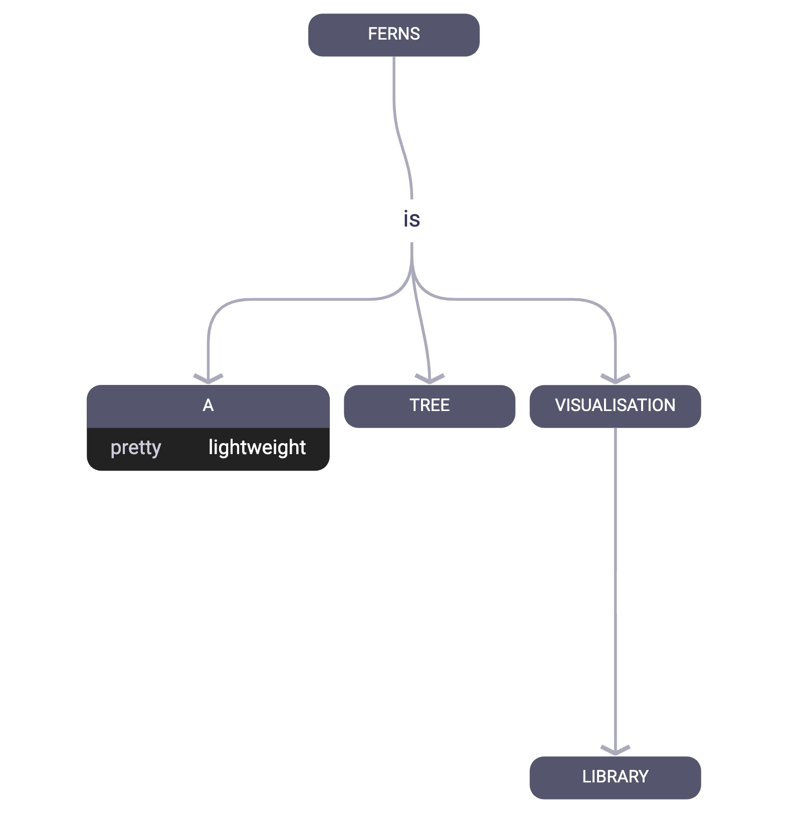

# Ferns

[](https://codesandbox.io/s/competent-resonance-hoeeu?file=/index.html)

[Try editing the tree live on CodeSandbox](https://codesandbox.io/s/competent-resonance-hoeeu?file=/index.html)

## How to use

You'll need to add the `ferns` package with `yarn` or `npm`.

### Browser rendering

Create your trees with the special `"ferns-tree"` class name:

```html
<pre class="ferns-tree">
a
  -- arrow -->
    b
    c
    d
  -- other arrow -->
    d
    e
    f
</pre>
```

Finally, invoke `DOM.makeFerns()` in the browser.

Alternatively, you can invoke `DOM.makeSingleFern()` and pass your tree code directly:

```typescript
import { DOM } from 'ferns';

DOM.makeSingleFern((containerElement, {
  code: `
    a
      -- arrow -->
        b
        c
    `,
  zoomable: true,
  draggable: true,
});
```

## Server rendering

You can render a fern to PNG (or SVG, or PDF) in Node using the `canvas` package:

```typescript
import { createCanvas } from "canvas";
import { Renderer } from "ferns";

const buffer = Renderer.render(
  (width, height) => {
    const canvas = createCanvas(width, height);
    return {
      ctx: canvas.getContext("2d"),
      save: () => canvas.toBuffer(),
    };
  },
  {
    code: `
    a
      -- arrow -->
        b
        c
    `,
    maxWidth: 600,
  }
);
```

## Dependencies

This package doesn't have any runtime dependencies, other than the Roboto font (which you can override). Note that the font should be loaded before you render.

## Acknowledgements

This was inspired by the amazing [Mermaid](https://mermaid-js.github.io/mermaid/).
